# HypeX AI

<p align="center">
	
</p>

<p align="center">
	AI-powered meme coin intelligence platform with real-time market signals, social sentiment ingestion, trust/risk scoring, and replay analytics.
</p>

<p align="center">
	
	
	
	
	
	
</p>

## Table of Contents

- [Overview](#overview)
- [Key Features](#key-features)
- [Preview](#preview)
- [UI Showcase](#ui-showcase)
- [Architecture](#architecture)
- [Workflow](#workflow)
- [Tech Stack](#tech-stack)
- [Project Structure](#project-structure)
- [Quick Start](#quick-start)
- [Environment Variables](#environment-variables)
- [Available Scripts](#available-scripts)
- [API Reference](#api-reference)
- [ML and Data Pipelines](#ml-and-data-pipelines)
- [Deployment Notes](#deployment-notes)
- [Troubleshooting](#troubleshooting)

## Overview

HypeX AI is a full-stack crypto analytics platform focused on meme coins and social-driven market moves. It combines:

- live token market snapshots (DexScreener)
- social ingestion from Twitter/X and Reddit
- sentiment analysis and trust/risk scoring
- trend, anomaly, and replay analytics for decision support

## Key Features

- Real-time dashboard for momentum, trust, and signal monitoring
- Alerts system with status/severity tracking
- Trending coins and per-coin detail endpoints
- Influence analytics and radar metrics
- Social data fetch and CSV export pipeline
- Model training and scored-dataset generation scripts
- Wallet-gated frontend dashboard routes

## Preview

### Landing / Hero

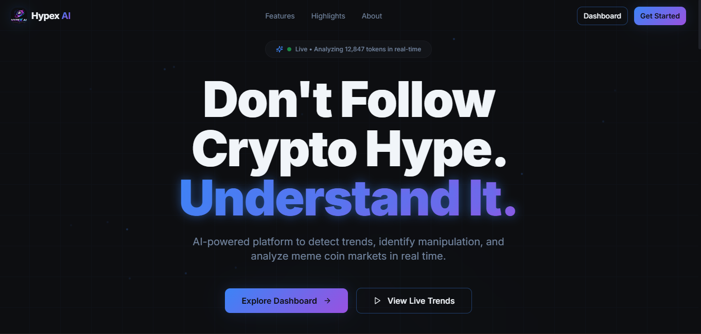

### Backend API Docs

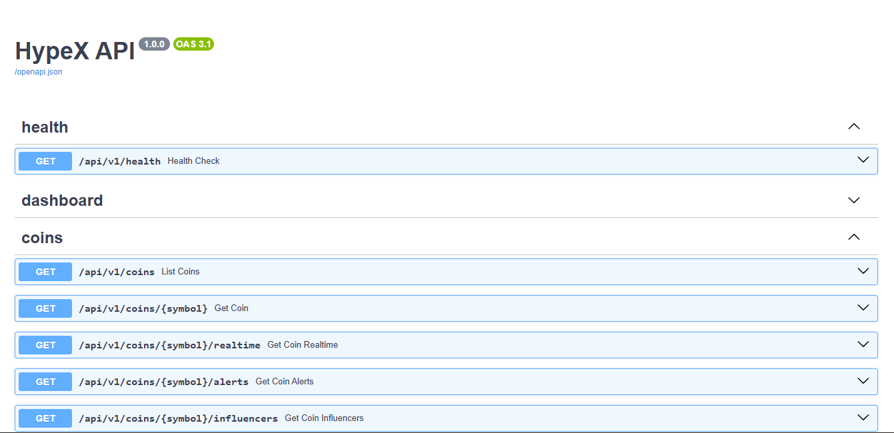

## UI Showcase

### Dashboard

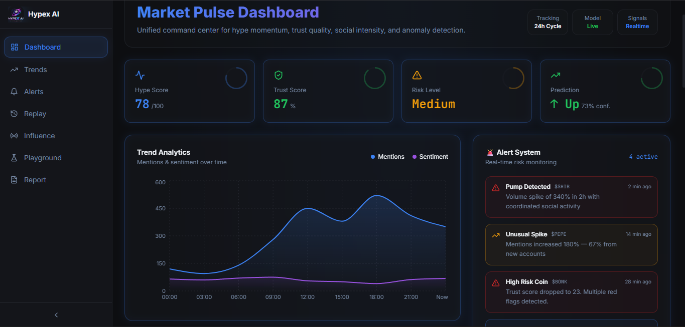

### Trends

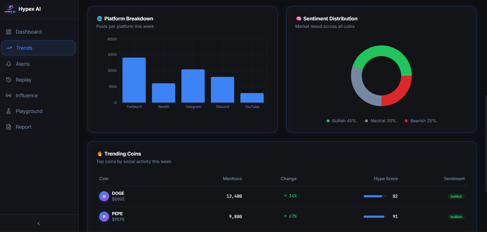

### Alerts

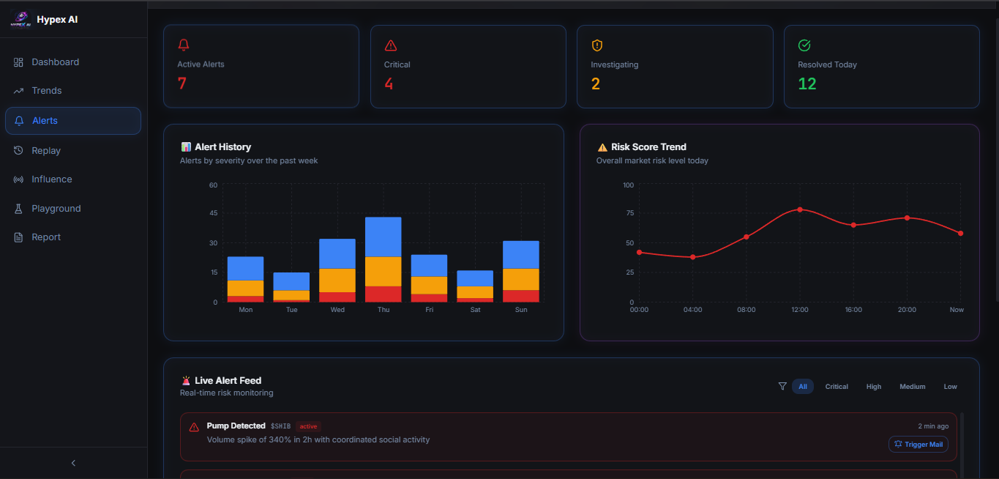

### Influence

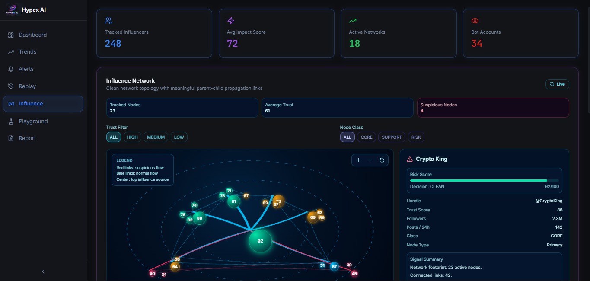

### Playground

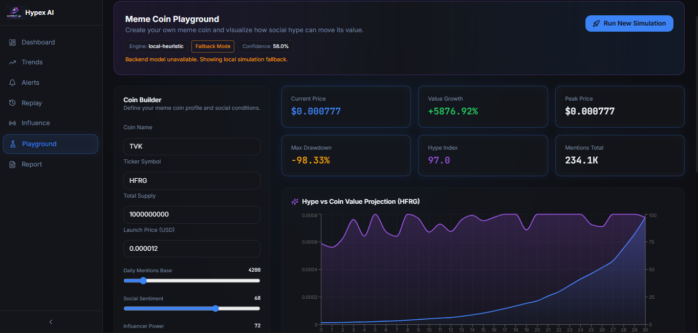

### Report

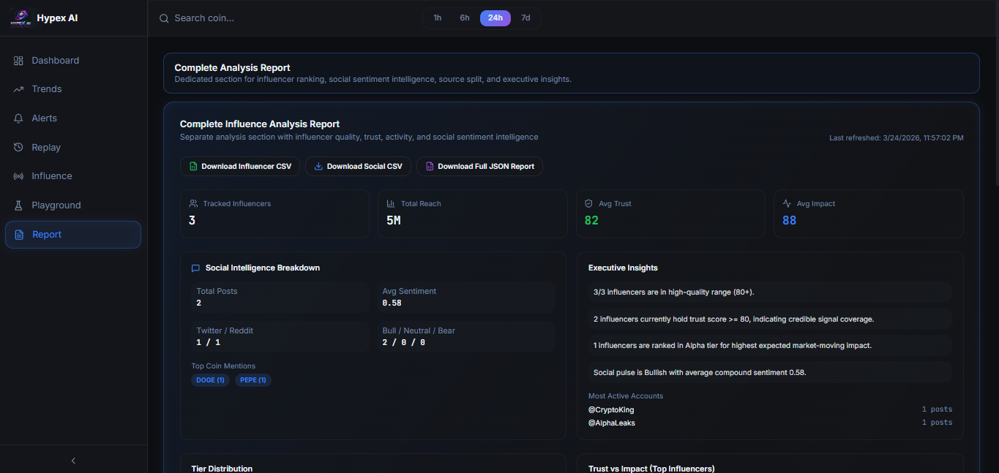

## Architecture

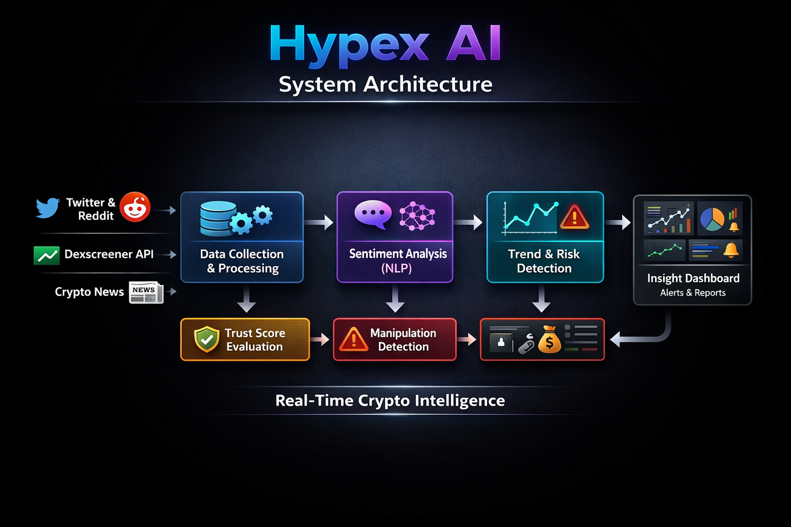

### Architecture (Text Diagram)

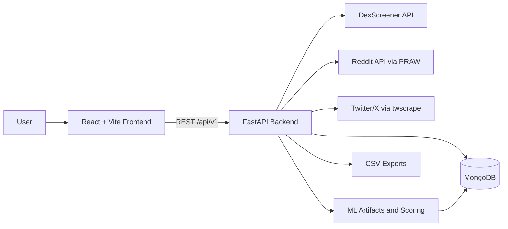

## Workflow

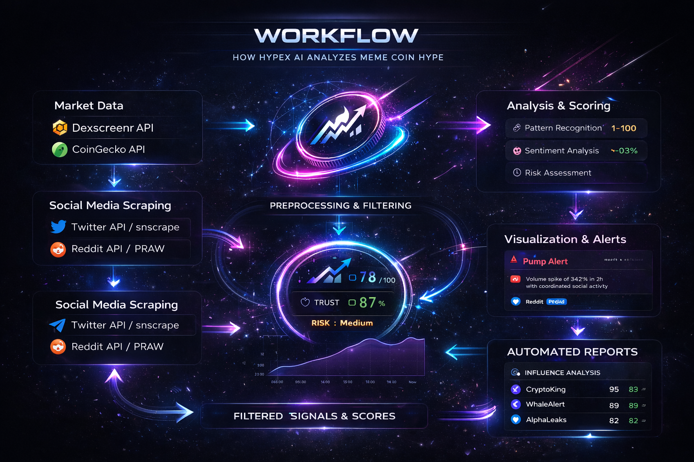

### Workflow (Text Diagram)

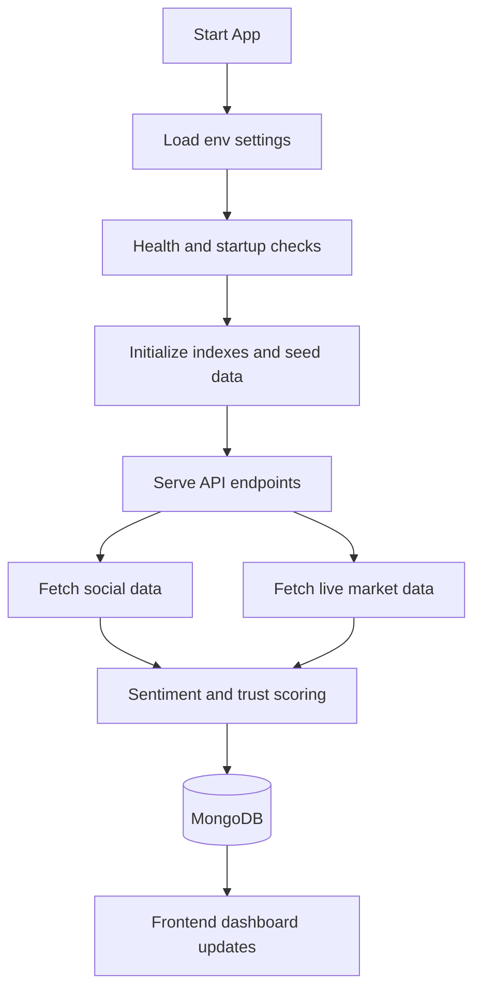

## Tech Stack

### Frontend

- React 18 + TypeScript
- Vite
- Tailwind CSS + shadcn/ui
- TanStack Query
- React Router

### Backend

- FastAPI + Uvicorn
- PyMongo + MongoDB
- Pydantic v2 / pydantic-settings
- httpx

### Data and ML

- scikit-learn
- numpy
- joblib
- vaderSentiment
- networkx

## Project Structure

```text
.
├── src/                     # Frontend app (pages, components, hooks)
├── public/                  # Static assets (logo, robots)
├── images/                  # README preview images
├── backend/
│   ├── app/                 # FastAPI app (routes, schemas, db, services)
│   ├── ml_artifacts/        # Trained model files
│   ├── exports/             # Generated CSV outputs
│   └── requirements.txt
├── data/                    # Meme coin datasets
└── README.md
```

## Quick Start

### 1) Clone and install frontend dependencies

```bash
git clone https://github.com/itzdineshx/HypeX-Ai.git
cd HypeX-Ai
npm install
```

### 2) Setup backend virtual environment

```bash
cd backend
python3 -m venv .venv
source .venv/bin/activate
pip install -r requirements.txt
```

### 3) Configure environment variables

```bash
cp .env.example .env
```

Edit backend/.env with your MongoDB URI and optional API credentials.

### 4) Run backend

From project root:

```bash
npm run backend:dev
```

API docs:

- Swagger UI: http://localhost:8000/docs
- ReDoc: http://localhost:8000/redoc

### 5) Run frontend

From project root in another terminal:

```bash
npm run dev
```

Frontend default URL: http://localhost:8080

## Environment Variables

Core backend keys (see backend/.env.example):

- APP_NAME
- ENVIRONMENT
- API_V1_PREFIX
- MONGODB_URI
- MONGODB_DB_NAME
- CORS_ORIGINS

Social ingestion keys:

- REDDIT_CLIENT_ID
- REDDIT_CLIENT_SECRET
- REDDIT_USER_AGENT
- REDDIT_SUBREDDITS
- TWITTER_QUERIES
- TWITTER_ACCOUNTS_DB
- SOCIAL_CSV_DIR

Market/API keys:

- ETHERSCAN_API_KEY
- COINDESK_API_KEY
- COINGECKO_API_KEY
- DEXSCREENER_SEARCH_URL
- DEXSCREENER_PROFILE_URL

## Available Scripts

From project root:

- npm run dev: Start Vite frontend dev server
- npm run build: Build frontend production assets
- npm run preview: Preview built frontend
- npm run lint: Run ESLint
- npm run test: Run Vitest tests
- npm run backend:dev: Start FastAPI backend in reload mode
- npm run backend:start: Start FastAPI backend in production mode

## API Reference

Base URL:

http://localhost:8000/api/v1

Core routes:

- GET /health
- GET /dashboard/summary
- GET /dashboard/trending
- GET /dashboard/trend-chart
- GET /coins
- GET /coins/{symbol}
- GET /coins/{symbol}/realtime
- GET /coins/{symbol}/alerts
- GET /coins/{symbol}/influencers
- GET /alerts
- POST /alerts
- PATCH /alerts/{alert_id}/status
- GET /influence/top
- GET /influence/metrics
- GET /influence/radar
- POST /social/fetch
- GET /social/posts
- POST /models/train-all
- POST /models/score-meme-data
- GET /replay/events

## ML and Data Pipelines

Run model training:

```bash
cd backend
python train_all_models.py
```

Fetch social data:

```bash
cd backend
python fetch_social_data.py --twitter-limit 120 --reddit-limit 60
```

Score meme coin dataset:

```bash
cd backend
python score_meme_coin_data.py
```

Artifacts and exports are written to:

- backend/ml_artifacts
- backend/exports/scored
- backend/exports/social

## Deployment Notes

- Backend startup command:

```bash
uvicorn app.main:app --host 0.0.0.0 --port $PORT
```

- On Render/Cloud platforms, ensure:
	- valid CORS_ORIGINS format (JSON array or comma-separated)
	- MONGODB_URI points to a reachable Atlas/managed MongoDB instance
	- MongoDB network access allows your deployment egress IP

## Troubleshooting

- App fails during startup with CORS parsing error:
	- Fix malformed CORS_ORIGINS value in host environment variables.
- App fails to connect to MongoDB (TLS / server selection timeout):
	- Verify Atlas network access list, database user credentials, and URI format.
- Frontend cannot reach backend:
	- Confirm backend is running on port 8000 and CORS includes frontend origin.

---

Built for data-driven crypto signal exploration and rapid full-stack iteration.
